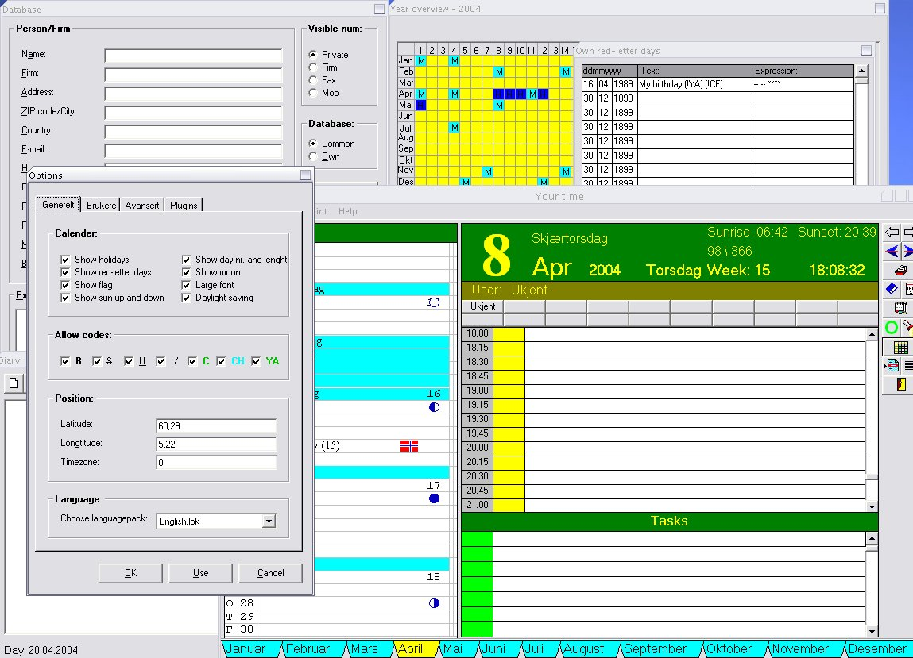



## YourTime

### Description

This is an electronic-calender that can do a plenty of things. It can function as a Diary, keep track of special dates and occasions, have serveral users, collect information about your contacts and help you with appointsments and tasks. Plus, it can tell you when the sun rises and sets; and the time, week, weekday and month. And it can of course let you search in all the data.
 
### More Info
 
When you use the "red-letter" editor, you use some tags to let the text be more suitable:

(!CF) = Insert a flag

(!CH) = The day will be "holy" and marked blue.

(!YA) = Will be replaced with how many years it has been since the event took place.

(!FB) = Makes the text bold

(!FI) = Makes the text italic

(!FU) = Makes the text underlined

(!FS) = Makes the text strike-troughed

(!FR) = Reset the font

And the "Expression:" is simply an string that tells the program how to compare the date. "-" is equal, "^" is not equal, "+" and "?" will OR or XOR the current state (check the source code in SimpleRegExp) and everything else is ignore. So if you want the program to check if the month and date is equal, then you'll have to write this string:

--.--.

----

And, the order is [day].[month].[year], NOT [month].[day].[year]!

             |
---                |---
**Submitted On**   |2004-11-21 01:50:08
**By**             |[Kristian S\. Stangeland](https://github.com/Planet-Source-Code/PSCIndex/blob/master/ByAuthor/kristian-s-stangeland.md)
**Level**          |Advanced
**User Rating**    |5.0 (20 globes from 4 users)
**Compatibility**  |VB 5\.0, VB 6\.0
**Category**       |[Complete Applications](https://github.com/Planet-Source-Code/PSCIndex/blob/master/ByCategory/complete-applications__1-27.md)
**World**          |[Visual Basic](https://github.com/Planet-Source-Code/PSCIndex/blob/master/ByWorld/visual-basic.md)
**Archive File**   |[YourTime18215711242004\.zip](https://github.com/Planet-Source-Code/kristian-s-stangeland-yourtime__1-57342/archive/master.zip)

### API Declarations

Too many.

